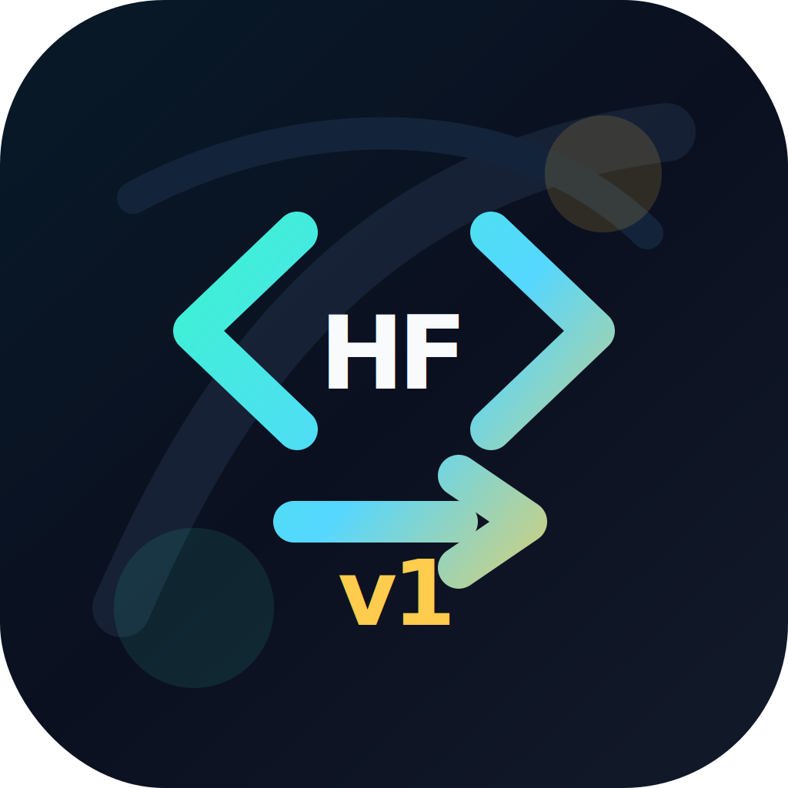

# Hugging Face Hub v1 Migrator

<p align="center">
  
</p>

LibCST codemod for migrating `huggingface_hub` v0.x Python call sites toward v1.x-safe APIs.

The safety model is intentionally conservative:

- High-confidence API changes are rewritten deterministically.
- Risky semantic migrations are reported for bounded AI review instead of being rewritten blindly.
- The output is syntax-checked in tests and the codemod is idempotent.

## Why this exists

`huggingface_hub` v1.0 switches important internals from `requests`/git-oriented workflows to HTTPX-based APIs. The [official migration guide](https://huggingface.co/docs/huggingface_hub/concepts/migration) documents the changes, but large AI projects still need repeatable source migration, review reports, and safe handling of ambiguous cases.

This project targets the Boring AI pattern: deterministic CST rules first, AI fallback only for low-confidence blocks.

## Deterministic fixes

| Legacy pattern | New pattern |
| --- | --- |
| `use_auth_token=` | `token=` |
| `hf_hub_download(..., resume_download=...)` | argument removed |
| `hf_hub_download(..., force_filename=...)` | argument removed |
| `hf_hub_download(..., local_dir_use_symlinks=...)` | argument removed |
| `InferenceApi(...)` | `InferenceClient(...)` |
| `update_repo_visibility(...)` | `update_repo_settings(...)` |
| locally constructed `HfApi()` instance methods | selected method/kwarg migrations |
| `HfFolder.get_token()` | `get_token()` |
| `except requests.HTTPError` around HF calls | `except HfHubHttpError` |
| `login(write_permission=...)` | argument removed |
| `login(new_session=True/False)` | `skip_if_logged_in=False/True` |
| single `list_models(task/library/language/tags=...)` filter | `list_models(filter=...)` |
| `build_hf_headers(is_write_action=...)` | argument removed |
| `AsyncInferenceClient(trust_env=True)` | argument removed |
| `constants.hf_cache_home` | `constants.HF_HOME` |

## Review-only findings

These are intentionally not auto-fixed:

- `Repository(...)`: requires semantic migration to `snapshot_download`, `HfApi.upload_file`, or `HfApi.upload_folder`.
- `**kwargs` passed into HF calls: may hide removed keys such as `use_auth_token`.
- combined `list_models(library=..., task=..., tags=...)` filters: combining filters incorrectly can change results.
- `configure_http_backend(...)`: v1 uses HTTPX client factories.
- `HfFolder.save_token()` / `HfFolder.delete_token()`: requires login/logout intent detection.
- `AsyncInferenceClient(trust_env=False)` or dynamic `trust_env`: may require explicit HTTPX client factory configuration.
- `get_token_permission(...)`: removed in v1.x; permission-dependent token logic needs human review.

## Usage

```bash
pip install -e .
hf-hub-v1-migrator path/to/repo --report hf-v1-report.json
hf-hub-v1-migrator path/to/repo --diff
hf-hub-v1-migrator path/to/repo --write --report hf-v1-report.json
```

## AI fallback

AI is used only for high-risk findings. It does not overwrite files. The suggestion is stored in the JSON report as `ai_suggestion`.

Currently AI fallback is triggered for cases such as:

- `Repository(...)`, because it may need `snapshot_download`, `HfApi.upload_file`, or `HfApi.upload_folder` depending on intent.
- `**kwargs` passed into Hugging Face Hub calls, because deprecated keys can be hidden inside a dict.
- `list_models(...)` filters that changed behavior in v1.x.
- custom HTTP backend configuration and non-trivial `HfFolder` token flows.

Put your URL and API key in a local `.env` file. Do not commit it:

```bash
cp .env.example .env
```

```dotenv
HF_MIGRATOR_AI_BASE_URL=https://api.openai.com/v1
HF_MIGRATOR_AI_API_KEY=replace-with-your-api-key
HF_MIGRATOR_AI_MODEL=gpt-4o-mini
```

Then run:

```bash
hf-hub-v1-migrator path/to/repo --report hf-v1-report.json --ai-fallback
```

For bounded AI patching, add `--apply-ai`. This asks the model for a strict JSON proposal, then asks a second AI reviewer for a risk score. The patch is applied only when:

- the proposal targets a single function or statement block
- the AI reviewer returns `decision: "apply"`
- the risk score is below `--ai-risk-threshold` (default `0.35`)
- the patched file parses with LibCST and compiles with Python

```bash
hf-hub-v1-migrator path/to/repo --write --report hf-v1-report.json --ai-fallback --apply-ai
```

If the reviewer marks the patch as risky, the report keeps the JSON proposal and review result, but the source file is not changed.

If your provider gives the full chat-completions URL, this also works:

```dotenv
HF_MIGRATOR_AI_BASE_URL=https://your-provider.example/v1/chat/completions
```

For local development:

```bash
pip install -e ".[test]"
pytest
```

## Example

Before:

```python
from huggingface_hub import HfFolder, hf_hub_download

token = HfFolder.get_token()
path = hf_hub_download("bert-base-uncased", "config.json", use_auth_token=token)
```

After:

```python
from huggingface_hub import hf_hub_download, get_token

token = get_token()
path = hf_hub_download("bert-base-uncased", "config.json", token=token)
```

The cleanup pass removes migrated Hugging Face imports only when it can prove the local name is unused.

## Report shape

```json
{
  "summary": {
    "files_scanned": 12,
    "files_changed": 4,
    "auto_fixes": 25,
    "findings": 3
  },
  "files": [
    {
      "path": "repo/model_push.py",
      "changed": false,
      "auto_fixes": 0,
      "findings": [
        {
          "code": "HF501",
          "severity": "warning",
          "line": 12,
          "message": "Repository is git-backed and removed in v1.x; rewrite to snapshot_download, HfApi.upload_file, or HfApi.upload_folder based on surrounding logic.",
          "ai_recommended": true
        }
      ]
    }
  ]
}
```

## Test strategy

- Golden fixtures compare exact `before.py` to `after.py`.
- Negative fixtures assert unrelated APIs and same-name kwargs are untouched.
- Every golden output is compiled with `compile(..., mode="exec")`.
- Idempotency is enforced by running the transform twice.
- AI patch tests verify low-risk function-local patches can be applied and high-risk proposals are rejected.

## Validation snapshot

Local fixture suite:

```text
26 passed
```

AI fallback smoke test:

```text
1 Repository(...) finding
ai_fallback.configured = true
ai_suggestion generated = true
```

Real package benchmark:

```text
sentence-transformers==2.2.2, peft==0.4.0, diffusers==0.16.1 source distributions
315 Python files scanned
11 files changed
30 deterministic fixes
8 AI/manual review findings
315 transformed modules compile successfully in memory
0 syntax failures
```

Representative diff:

```diff
-from huggingface_hub import DatasetCard, DatasetCardData, HfApi, HfFolder
+from huggingface_hub import DatasetCard, DatasetCardData, HfApi, HfFolder, get_token

-token = token if token is not None else HfFolder.get_token()
+token = token if token is not None else get_token()
```

## Codemod workflow

The root `workflow.yaml` wraps the Python engine so the same migration can run as a Codemod workflow package.

For repeatable scoring evidence:

```bash
python scripts/benchmark_coverage.py path/to/package-a path/to/package-b --output hf-v1-benchmark-report.json
```
